# Oscar — H0 hackathon submission assets

**Live demo:** https://goldvale.vercel.app — opens on a landing page; **"Explore the live
demo"** goes to Oscar's dashboard (no account needed), or **"Set up your own pet"** creates
a real account. Every screen links from the dashboard.

**Repo:** https://github.com/chunghaw/oscar (public, MIT) · **Vercel team:** `team_1NrzZKgn3I3Rh1M8ZHukgoOw`

> Oscar tracks, remembers, and prepares — it **never diagnoses**. Clinical scores
> are computed by deterministic code (`lib/domain`), never the LLM; every model line
> passes `assertNonClinical()`.

## Project description (paste-ready — edit into your own voice before submitting)

**Oscar is a calm daily companion and home-rehabilitation tracker for owners of senior or chronically-ill dogs and cats.** A 20-second daily check-in trends a validated mobility score (GenPup-M), stores the vet's rehab plan, and — when something feels off — answers *"has this happened before?"* by searching the pet's own history by meaning. It supports the vet's plan; it never diagnoses.

**Who it's for:** the person managing a slow decline at home between vet visits — an aging dog with arthritis, a cat recovering from cruciate surgery. They want to notice patterns and walk into each appointment with the full picture, not a vague "he's been a bit slow lately."

**Why Aurora PostgreSQL + pgvector (the one-sentence answer):** a senior pet's health record is relational, time-series, *and* semantic at the same time — so we keep all of it in one Aurora instance, where *"this stiff morning resembles five weeks ago"* (text kNN over journal entries) and *"compare today's incision to last month"* (image kNN over Titan multimodal embeddings) are both just SQL against the same rows, with no second datastore and no sync pipeline. Four layers do real work on every request: relational (pet → plan → meds), **range-partitioned** time-series (check-ins, mobility, adherence), **pgvector in two modalities** (journal text + media images, HNSW cosine), and **materialized-view analytics** (per-pet baselines, MCID crossings, weekly adherence).

**The engineering decision worth noting:** every clinical number is computed by deterministic code (`lib/domain`), never the LLM. Bedrock's Claude only *narrates* trends and poses "questions for your vet"; every model line passes an `assertNonClinical()` guardrail and red flags route to "contact your vet now." A health-adjacent AI product made safe by construction, not by prompt-wishing.

**Stack:** Next.js 16 on Vercel · AWS Aurora PostgreSQL Serverless v2 + pgvector · Amazon Bedrock (Claude Sonnet 4.6 + Titan text & multimodal embeddings) · S3 for media · Auth.js email-password accounts (the demo pet is public).

## Architecture

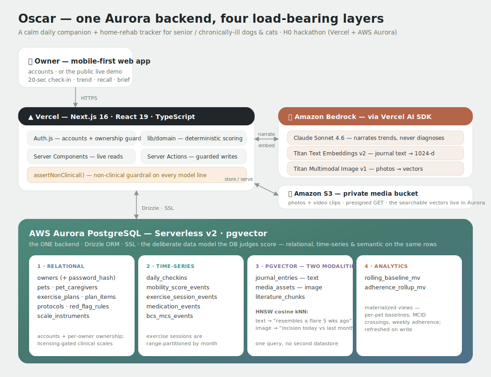

One **AWS Aurora PostgreSQL (Serverless v2)** backend, four load-bearing layers, with
**Amazon Bedrock** (Claude Sonnet 4.6 narration + Titan **text & multimodal-image**
embeddings) via the Vercel AI SDK, **S3** for media bytes, and **Auth.js** accounts — all
hosted on **Vercel** (Next.js 16).

## AWS-database proof — all four layers exercised per request

| Layer | In the schema | Proven by |
| --- | --- | --- |
| **Relational** | owners (+ `password_hash`) · pets · exercise_plans · plan_items · protocols · red_flag_rules · scale_instruments | accounts + per-owner ownership guard, dashboard plan/protocol |
| **Time-series** | daily_checkins · mobility_score_events · **range-partitioned** exercise_session_events · medication_events · bcs_mcs_events | mobility trend, adherence, check-in writes |
| **pgvector (×2 modalities)** | **journal_entries — text** · **media_assets — image** · literature_chunks (HNSW cosine) | recall screen (text kNN) **and** media "similar days" (image kNN) |
| **Analytics** | `rolling_baseline_mv` · `adherence_rollup_mv` (materialized views) | per-pet baselines, MCID crossings, weekly adherence |

## Screenshots (live, on real Aurora + Bedrock)

| Onboarding | Daily check-in | Dashboard |
| --- | --- | --- |
| 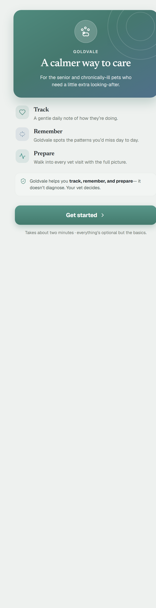 | 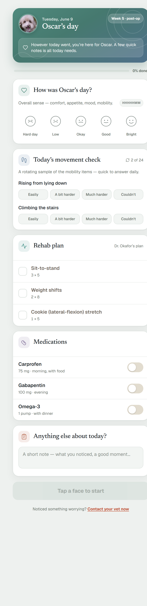 | 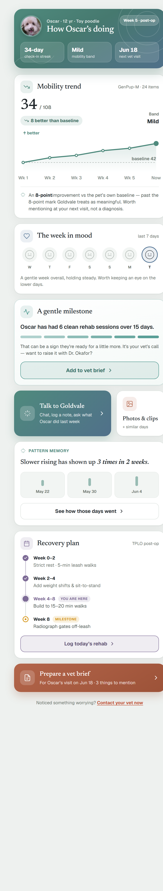 |

| Vet brief | Pattern-memory recall | Exercise track |
| --- | --- | --- |
| 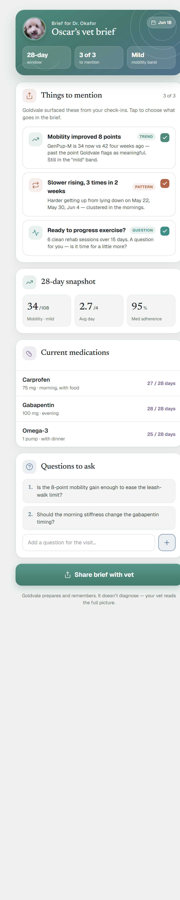 | 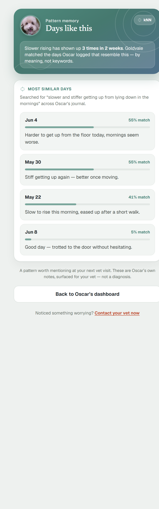 | 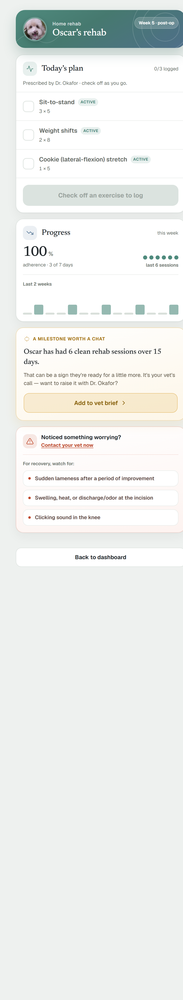 |

| AI companion (chat agent) | Visual recall (image kNN) | Contact-your-vet escalation |
| --- | --- | --- |
| 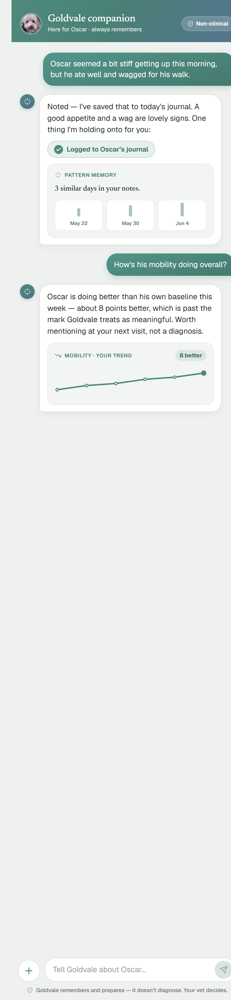 | 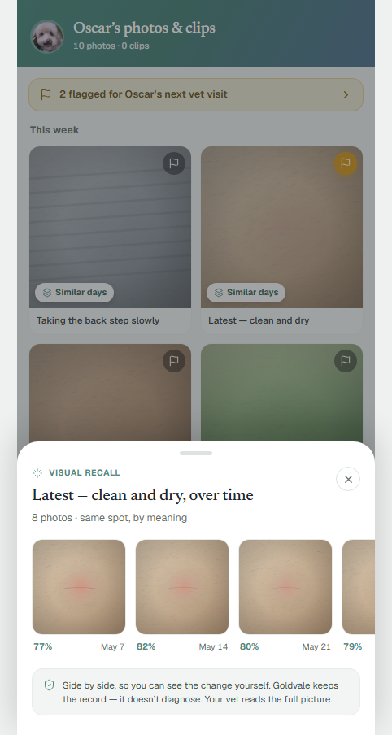 |  |

| Media library (photos + clips) | Video clip (tap-to-play) | Onboarding (create your own pet) |
| --- | --- | --- |
| 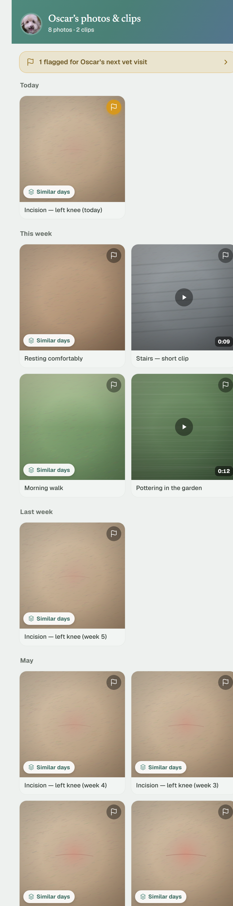 | 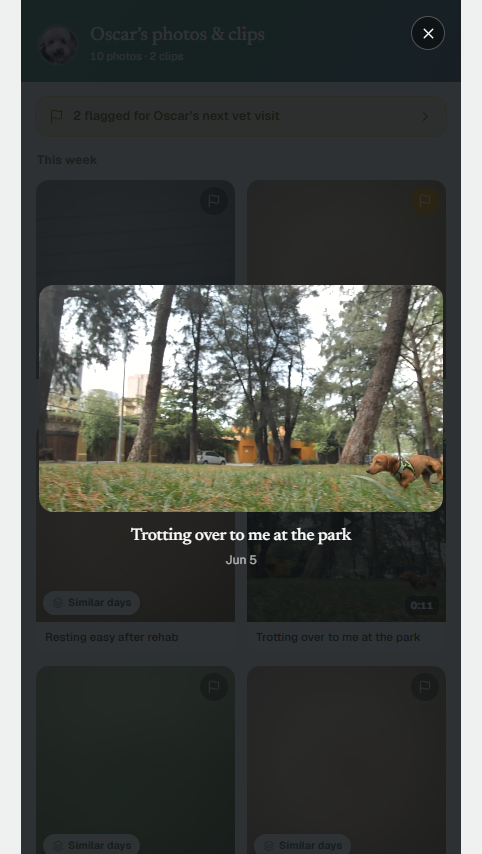 |  |

The **companion** is a non-clinical chat **agent**: Bedrock Claude (Sonnet 4.6) with
tool-use over Aurora — it logs the owner's notes, recalls their own history (pgvector),
narrates the mobility trend, flags items for the vet, and escalates red flags — with the
guardrail on every reply. The rich cards in the thread are real tool outputs.

The **media library** stores photos/clips in **S3** and embeds photos with **Titan
multimodal**; "Similar days" is a **pgvector kNN** over those image vectors — the incision
close-ups cluster in the high-0.80s cosine, clearly above the walk/rest/garden shots
(~0.61–0.76), so the owner sees the same spot heal over six weeks (the in-app overlay
shows ~77–82% match against an incision anchor). Two more layers exercised: object storage
+ multimodal vectors.

The **recall** screen is the pgvector payoff: it embeds the surfaced pattern with Titan
and kNN-ranks Oscar's own journal days by meaning — Jun 4 (55%), May 30 (55%),
May 22 (41%), and the "good day" correctly last at 5%. The **exercise track** is
vet-plan-gated: it logs adherence and surfaces the FITT progression nudge only when
`lib/domain` says it's earned — always a question, never an auto-advance.

## Submission checklist
- [x] Published Vercel project link
- [x] AWS database (Aurora PostgreSQL) as the primary backend — 4 layers
- [x] Public repo + MIT license
- [x] Architecture diagram (`docs/architecture.svg` / `.png`)
- [x] Screenshots proving Aurora use (`docs/screenshots/`)
- [x] Vercel Team ID
- [ ] <3-minute demo video
